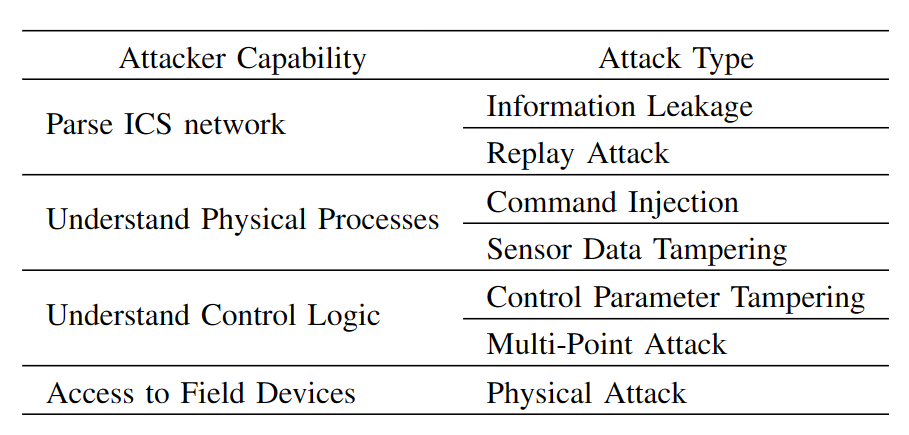

# Cyber-security-dataset-of-EDS

### Attack model
The types of attacks and implementation criteria designed by attackers with different capabilities are presented as below. The experimental platform allows for the design of attack types that cover all aspects of digital inputs, control parameters and analog inputs. The level of attack increases gradually, starting with network access and progressively acquiring the knowledge required for the attack to realize advanced stealth attacks.

  
    

  

1. Access to ICS network
   - Attackers focus on gathering information about the topology and devices in the industrial control network. 
     - Information Leakage: Use scanning tools to obtain critical information such as IP addresses, device models, and operating systems of the devices on the industrial control network.  
     - Replay Attack: Resend the eavesdropped data to the receiver without knowing the exact meaning of the specific data being replayed.

2. Understand Physical Processes
   - Attackers conduct in-depth research on control programs and relevant materials to understand the physical significance of each point in the PLC.
     - Command Injection: Manipulate system behavior or gain unauthorized access by inserting malicious commands into the input. 
     - Sensor Data Tampering: Maliciously manipulate the parameters of sensors to deceive the system.

3. Understand Control Logic
   - Attackers possess higher technical skills.
     - Control Parameter Tampering: Collect and analyze extensive normal data to gain an in-depth understanding of the system’s operational patterns and the logical relationships between different points, so as to achieve control parameter tampering.
     - Multi-Point Attack: Adopt more covert attack methods, design multiple control commands to execute coordinated attacks, aiming to control and disrupt the system without arousing excessive suspicion.

4. Access to Field Devices
   - Unlike the previous categories that are limited to network penetration, physical attackers can directly access the location of the control equipment through social engineering means.
     - Physical Attack: Including damaging equipment, manipulating operations, or exploiting the help of internal employees to execute attacks.
    
# Citation Request
Please cite the following paper if you use this dataset: Y. Xue, J. Pan, Y. Geng, Z. Yang, M. Liu and R. Deng, "Real-Time Intrusion Detection Based on Decision Fusion in Industrial Control Systems," in IEEE Transactions on Industrial Cyber-Physical Systems, vol. 2, pp. 143-153, 2024, doi: 10.1109/TICPS.2024.3406505.

keywords: {Security;Intrusion detection;Integrated circuit modeling;Real-time systems;Data models;Computer security;Production;Cybersecurity datasets;decision fusion;industrial control systems;intrusion detection},

> @ARTICLE{10540291,
  author={Xue, Yawen and Pan, Jie and Geng, Yangyang and Yang, Zeyu and Liu, Mengxiang and Deng, Ruilong},
  journal={IEEE Transactions on Industrial Cyber-Physical Systems}, 
  title={Real-Time Intrusion Detection Based on Decision Fusion in Industrial Control Systems}, 
  year={2024},
  volume={2},
  number={},
  pages={143-153},
  keywords={Security;Intrusion detection;Integrated circuit modeling;Real-time systems;Data models;Computer security;Production;Cybersecurity datasets;decision fusion;industrial control systems;intrusion detection},
  doi={10.1109/TICPS.2024.3406505}}

